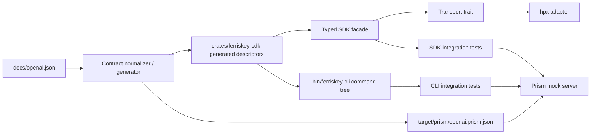

# Design Document: FerrisKey SDK CLI

| Metadata | Details |
| :--- | :--- |
| **Author** | pb-plan agent |
| **Status** | Draft |
| **Created** | 2026-03-17 |
| **Reviewers** | N/A |
| **Related Issues** | N/A |

## 1. Executive Summary

The repository currently contains a Rust workspace template, while `docs/openai.json` defines a large FerrisKey API contract with 72 paths, 107 operations, 12 tag groups, and 154 schemas. The requested change is to replace the template placeholders with a production-grade Rust SDK under `crates/`, add a `bin/ferriskey-cli` binary that can invoke every documented operation through subcommands and flags, and verify the implementation against a Prism mock server so contract drift is caught before release.

**Problem:** The codebase has no FerrisKey-specific SDK, no CLI surface for the documented API, and no automated contract validation against the OpenAPI document.
**Solution:** Introduce a generated-but-reviewable FerrisKey SDK crate backed by a shared operation registry, a dynamic Clap command tree that reuses the same contract metadata, and a Prism-backed integration harness that sweeps every documented operation while preserving the workspace's Rust-first BDD + TDD workflow.

---

## 2. Requirements & Goals

### 2.1 Problem Statement

The current workspace exposes only template artifacts: `bin/cli-app`, `crates/common`, a checkout demo, and placeholder repository metadata. In contrast, `docs/openai.json` describes a real FerrisKey API surface spanning authentication, realms, clients, users, roles, federation, identity providers, webhooks, Compass analytics, and Seawatch. Implementing this contract manually without a shared descriptor layer would be error-prone, especially because the request also requires a CLI for every endpoint and Prism-based contract verification for the full surface.

The OpenAPI document itself also has integration quirks that the implementation must absorb safely: it declares a request-level `security` block for at least one user operation but omits `components.securitySchemes`, declares no `servers`, and has an incomplete root-level `tags` list even though operation-level tags cover 12 API groups. The plan must therefore include contract normalization for testing and code generation while preserving `docs/openai.json` as the source of truth.

### 2.2 Functional Goals

1. **Full SDK Coverage:** Expose every operation in `docs/openai.json` through a Rust SDK crate under `crates/`, with request/response typing derived from the documented schemas.
2. **Complete CLI Surface:** Add `bin/ferriskey-cli` and make every documented operation invocable through CLI subcommands plus flags or JSON-body arguments.
3. **Contract-Aligned Execution:** Ensure the SDK and CLI serialize path, query, header, and body data according to the OpenAPI contract and decode documented responses into typed results.
4. **Prism Integration Testing:** Use Stoplight Prism as the mock server for integration tests so every implemented interface is exercised against the contract, not only hand-picked examples.
5. **Template Identity Cleanup:** Replace placeholder crate names and workspace metadata so the implementation reflects FerrisKey rather than the starter template.
6. **Rust Workflow Compliance:** Preserve the repository's outside-in workflow with Gherkin scenarios, crate-local tests, `proptest` where input space is broad, and the existing `just` verification cadence.

### 2.3 Non-Functional Goals

- **Performance:** Avoid unnecessary runtime reflection and duplicated contract parsing. Contract metadata should be generated or normalized once, then reused by the SDK, CLI, and tests.
- **Reliability:** Prism-backed integration coverage must sweep all 107 operations so unimplemented paths or response mismatches are surfaced deterministically.
- **Security:** Auth-bearing requests must flow through a single explicit auth strategy, with bearer handling isolated from business logic. Secret-bearing CLI options must avoid accidental logging.
- **Maintainability:** Keep generated contract details and handwritten runtime logic separate so future contract updates do not require editing dozens of unrelated files.
- **Observability:** Prism-backed tests and CLI flows should capture logs plus a live probe command so failures are diagnosable in CI.

### 2.4 Out of Scope

- Implementing or modifying the actual FerrisKey server behind the OpenAPI document.
- Adding benchmark scaffolding or Criterion unless a later requirement introduces a concrete latency or throughput target.
- Adding fuzzing targets, because the current scope parses a trusted repository-owned OpenAPI file rather than hostile external payloads and does not introduce `unsafe` or binary decoding work.
- Building a TUI, REPL, or interactive shell on top of the CLI.
- Supporting undocumented FerrisKey endpoints or speculative server behavior not present in `docs/openai.json`.

### 2.5 Assumptions

- `docs/openai.json` is the authoritative contract even though the file name says `openai`; the `info.title` value shows this is actually the FerrisKey API.
- Prism will be invoked in tests as an external tool and does not need to become a runtime dependency of the shipped SDK or CLI.
- A contract-normalized artifact can be generated for Prism and codegen without mutating `docs/openai.json` itself.
- Missing root `servers` means the SDK and CLI must require a user-supplied base URL instead of deriving one from the spec.
- The workspace may remain a single Rust workspace with one primary SDK crate and one CLI crate; additional helper modules are preferred over proliferating new crates unless implementation pressure proves otherwise.

### 2.6 Requirements Coverage Checklist

| Requirement Type | Requirement | Planned Coverage |
| :--- | :--- | :--- |
| Functional | Full SDK for all documented endpoints | Sections 3.5, 3.6, 4.1, 4.3; Tasks 2.1 and 2.2; `sdk-contract.feature` |
| Functional | CLI subcommands plus parameters for all endpoints | Sections 3.5, 3.6, 4.1, 4.3; Task 2.3; `cli-invocation.feature` |
| Functional | Prism-backed integration tests for all interfaces | Sections 3.5, 5.3, 5.5; Tasks 3.1 and 3.2; `prism-contract.feature` |
| Constraint | Use Rust workspace conventions and `cucumber-rs` | Sections 3.3, 3.5, 3.8; Tasks 1.1, 3.2, 4.1 |
| Constraint | Prefer `hpx`, `eyre`, `thiserror`, `tracing`, `proptest` | Section 3.7, 4.3, 4.6; Tasks 1.3, 2.1, 2.2 |
| Architecture | External dependencies remain injectable | Sections 3.2, 3.7, 4.3; Tasks 1.3, 3.1 |
| Maintainability | Replace template identities and avoid hand-maintaining 107 operations | Sections 3.4, 3.7, 4.1; Tasks 1.1 and 1.2 |
| Non-goal | No server implementation or unrelated cleanup | Sections 2.4 and 3.8; all tasks scoped to SDK/CLI/test harness only |
| User-visible | Operator can call documented API from CLI | `cli-invocation.feature`; Tasks 2.3 and 3.2 |
| User-visible | Integrator can rely on SDK alignment with contract | `sdk-contract.feature`; Tasks 2.1, 2.2, 3.1 |

---

## 3. Architecture Overview

### 3.1 System Context

The new functionality sits entirely within the Rust workspace and uses `docs/openai.json` as the contract source. The SDK crate consumes a normalized view of the contract, exposes typed operations grouped by API tag, and delegates all HTTP work through a transport seam. The CLI binary reuses the same operation descriptors to build its command tree and translate command-line arguments into SDK requests. Prism runs only in tests and validates that generated descriptors, encoders, and decoders remain consistent with the contract.



### 3.2 Key Design Principles

- **Single contract source:** `docs/openai.json` stays authoritative. Generated descriptors, typed models, and CLI metadata must all derive from it rather than drift separately.
- **Handwritten runtime, generated contract surface:** Repetitive endpoint and schema definitions belong in generated modules, while transport, auth, configuration, and error-handling remain explicit handwritten Rust.
- **One seam per responsibility:** Transport, auth injection, CLI presentation, and contract normalization each get a single focused abstraction to satisfy SRP and keep tests small.
- **Tag-oriented ergonomics:** Because operation tags already partition the API into 12 domains, both SDK facades and CLI subcommands should use the same grouping to stay navigable.
- **Prism as contract oracle:** Success means more than compilation; every operation must execute against Prism so path templating, query encoding, body serialization, and response handling are verified end to end.

### 3.3 Existing Components to Reuse

| Component | Location | How to Reuse |
| :--- | :--- | :--- |
| Rust workspace layout | `Cargo.toml`, `bin/*`, `crates/*` | Keep the same workspace structure and replace template crates with FerrisKey-specific crates instead of creating a parallel project layout. |
| Shared lint and dependency policy | `Cargo.toml`, `AGENTS.md` | Keep root dependency management in `[workspace.dependencies]`, retain strict linting, use `eyre` at the application layer and `thiserror` in library code, and prefer `hpx` over `reqwest`. |
| Verification command cadence | `Justfile` | Extend existing `just` workflows rather than replacing them. The final implementation should still validate with `just format`, `just lint`, `just test`, `just bdd`, and `just test-all`. |
| Existing BDD convention | `features/checkout.feature`, `crates/common/tests/bdd.rs` | Preserve the pattern of root `features/` plus crate-local `tests/bdd.rs`, but move it to the FerrisKey SDK crate once the template crate is renamed. |
| Contract source file | `docs/openai.json` | Use this as the canonical API contract for generation, Prism validation, and CLI surface derivation. |

No reusable HTTP client, SDK abstraction, or CLI registry exists yet; those capabilities must be introduced.

### 3.4 Project Identity Alignment

| Current Identifier | Location | Why It Is Generic or Misaligned | Planned Name / Action |
| :--- | :--- | :--- | :--- |
| `cli-app` | `bin/cli-app/Cargo.toml`, `bin/cli-app/src/main.rs`, `README.md` | Template CLI name unrelated to FerrisKey | Rename crate directory and package name to `ferriskey-cli` and update command examples. |
| `common` | `crates/common/Cargo.toml`, `crates/common/src/lib.rs`, `Justfile` | Placeholder shared crate with checkout demo | Replace with `crates/ferriskey-sdk` and move BDD runner/tests there. |
| `Rust Workspace Template` references | `README.md` and demo code | Template copy no longer describes the repository goal | Rewrite docs around FerrisKey SDK + CLI usage. |
| `repository = "TODO"` | `Cargo.toml` | Placeholder metadata | Set the real repository URL during implementation. |

### 3.5 BDD/TDD Strategy

- **BDD Runner:** `cucumber`
- **BDD Command:** `cargo test -p ferriskey-sdk --test bdd`
- **Unit Test Command:** `cargo test -p ferriskey-sdk --all-features`
- **Property Test Tool:** `proptest`
- **Fuzz Test Tool:** `N/A` because the only parsed contract input is the repository-owned OpenAPI file and the planned implementation does not add parser-like hostile-input boundaries or `unsafe` code.
- **Benchmark Tool:** `N/A` because the requirement is completeness and conformance, not latency or throughput.
- **Outer Loop:** Gherkin scenarios will verify full contract exposure, CLI invocation, and Prism-backed conformance at the acceptance level.
- **Inner Loop:** Crate-local unit and property tests will drive request encoding, response decoding, descriptor generation, auth injection, and command argument normalization.
- **Step Definition Location:** `crates/ferriskey-sdk/tests/bdd.rs`

The outside-in loop starts with failing feature scenarios for SDK coverage, CLI invocation, and Prism contract validation. Each scenario then drives smaller unit or property tests inside `crates/ferriskey-sdk`, followed by Prism-backed integration tests and the crate-local BDD runner.

### 3.6 BDD Scenario Inventory

| Feature File | Scenario | Business Outcome | Primary Verification | Supporting TDD Focus |
| :--- | :--- | :--- | :--- | :--- |
| `features/sdk-contract.feature` | SDK exposes every documented operation | Integrators get a Rust entrypoint for all contract operations without manual HTTP assembly | `cargo test -p ferriskey-sdk --test prism_contract sdk_exposes_all_operations` | Operation registry generation, typed facade generation, schema/model wiring |
| `features/sdk-contract.feature` | Secured operations apply bearer auth and decode structured responses | Authenticated calls behave predictably and return typed results | `cargo test -p ferriskey-sdk --test prism_contract secured_operations_send_bearer_auth` | Auth strategy, header injection, response classification |
| `features/cli-invocation.feature` | CLI command groups mirror API tags | Operators can discover commands by domain instead of memorizing URLs | `cargo test -p ferriskey-sdk --test cli_smoke cli_lists_tag_groups` | Tag metadata, command tree generation |
| `features/cli-invocation.feature` | CLI flags and JSON body arguments invoke the same contract as the SDK | Operators can call any documented endpoint without writing curl scripts | `cargo test -p ferriskey-sdk --test cli_smoke cli_invokes_operation_with_arguments` | Argument normalization, path/query/body serialization |
| `features/prism-contract.feature` | Contract normalization preserves the API surface | Test tooling can use Prism without silently dropping or mutating operations | `cargo test -p ferriskey-sdk --test prism_contract normalized_contract_preserves_operation_counts` | Spec normalization, descriptor diffing |
| `features/prism-contract.feature` | Prism sweep validates every documented operation | Contract drift is detected before release | `cargo test -p ferriskey-sdk --test prism_contract prism_sweep_covers_every_operation` | Operation sweep harness, Prism process lifecycle |

### 3.7 Architecture Decisions

**Inherited Decisions To Preserve**

- Keep executable crates under `bin/*` and reusable library crates under `crates/*`.
- Use `cucumber-rs` for BDD, crate-local tests for TDD, and `proptest` inside normal `cargo test` flow.
- Use `eyre` in the application layer, `thiserror` in library code, `tracing` for observability, and prefer `hpx` over `reqwest`.
- Avoid broad refactors unrelated to the feature and keep cleanup scoped to touched modules.

**Pattern Evaluation**

- **Factory:** Selected for producing tag-specific SDK facades and operation descriptors from the normalized contract. This keeps repetitive endpoint wiring out of handwritten code.
- **Adapter:** Selected for the HTTP boundary. A `Transport` trait with an `HpxTransport` adapter keeps the runtime dependency injectable and testable.
- **Strategy:** Used narrowly for auth application (`NoAuth`, `BearerToken`, later extensible). This isolates auth header policy from request construction.
- **Observer:** Rejected. The workflow does not need event fan-out, and introducing it would add indirection without solving a current problem.
- **Decorator:** Rejected as a primary structure. Request middleware stacks would complicate a workspace that currently has no middleware abstraction; explicit transport composition is simpler.

**SRP and DIP Reasoning**

- Contract normalization, runtime execution, and CLI presentation each have distinct reasons to change and therefore remain in separate modules.
- The SDK depends on an abstract transport interface rather than directly on `hpx`, which keeps Prism integration tests and future transport changes isolated.
- The CLI depends on the SDK's operation registry and typed execution boundary, not directly on raw HTTP or ad hoc JSON assembly.

**Code Simplifier Alignment**

The chosen approach avoids hand-maintaining 107 endpoints twice. Generated descriptors handle repetition, while handwritten modules remain focused on transport, config, error mapping, and CLI UX. This reduces nested `match` trees and duplicated serde code instead of adding ceremonial abstractions.

### 3.8 Code Simplification Constraints

- **Behavioral Contract:** The implementation intentionally replaces the template checkout and greeting behavior with FerrisKey SDK + CLI behavior. Beyond that required replacement, each SDK and CLI operation must preserve the semantics described by `docs/openai.json`.
- **Repo Standards:** Follow the workspace lint policy, do not use `unwrap`, keep docs/comments in English, route logging through `tracing`, and add dependencies through Cargo workflows during implementation.
- **Readability Priorities:** Prefer clear operation descriptors, named request/response types, and explicit argument translation over clever macro-heavy DSLs. Keep async control flow shallow and split helpers before large functions become opaque.
- **Refactor Scope:** Limit non-feature cleanup to the template rename, BDD harness migration, and FerrisKey-focused README/metadata updates.
- **Clarity Guardrails:** Avoid nested ternaries or dense builder chains in generated handwritten code paths. Generated output should still be deterministic, formatted, and reviewable.

### 3.9 Planner Contract Surface

- **PlannedSpecContract:** This spec folder is complete when `design.md`, `tasks.md`, and the feature files jointly define the intended module layout, verification strategy, and user-visible contract for SDK, CLI, and Prism validation.
- **TaskContract:** Each `Task X.Y` section in `tasks.md` is independently executable and must include scenario coverage, loop type, behavioral contract, simplification focus, verification commands, and runtime evidence expectations.
- **BuildBlockedPacket:** If `/pb-build` discovers a hard blocker such as an invalid Prism normalization path or a contract ambiguity that prevents code generation, it should record a markdown section named `Build Blocker` in `tasks.md` under the affected task with the failing command, observed blocker, and required human decision.
- **DesignChangeRequestPacket:** If implementation reveals a contract or architecture issue that changes this plan, `/pb-build` should add a markdown subsection named `Design Change Request` to `design.md` and cross-reference the impacted task IDs in `tasks.md` rather than silently diverging.

---

## 4. Detailed Design

### 4.1 Module Structure

The implementation should keep a single primary SDK crate and a single CLI crate, with code generation constrained to contract-derived modules.

```text
bin/
  ferriskey-cli/
    Cargo.toml
    src/
      main.rs
      command_tree.rs
      output.rs
crates/
  ferriskey-sdk/
    Cargo.toml
    build.rs
    src/
      lib.rs
      auth.rs
      config.rs
      descriptor.rs
      error.rs
      transport.rs
      client.rs
      generated/
        mod.rs
        models.rs
        operations.rs
        tags/
          auth.rs
          broker.rs
          client.rs
          client_scope.rs
          compass.rs
          federation.rs
          identity_provider.rs
          realm.rs
          role.rs
          seawatch.rs
          user.rs
          webhook.rs
    tests/
      bdd.rs
      prism_contract.rs
      cli_smoke.rs
features/
  ferriskey_sdk_cli.feature
target/
  prism/
    openai.prism.json
    prism.log
```

The generated directory can be emitted into `OUT_DIR` first, but the public module structure should remain stable and tag-oriented so handwritten code does not depend on raw generation internals.

### 4.2 Data Structures & Types

Core handwritten runtime types should stay compact and explicit:

```rust
pub struct FerriskeySdk<T: Transport> {
    config: SdkConfig,
    transport: T,
    registry: &'static OperationRegistry,
}

pub struct SdkConfig {
    pub base_url: String,
    pub auth: AuthStrategy,
}

pub enum AuthStrategy {
    None,
    Bearer(String),
}

pub struct OperationDescriptor {
    pub operation_id: &'static str,
    pub tag: ApiTag,
    pub method: HttpMethod,
    pub path_template: &'static str,
    pub parameters: &'static [ParameterDescriptor],
    pub request_body: Option<BodyDescriptor>,
    pub responses: &'static [ResponseDescriptor],
    pub auth: AuthRequirement,
}
```

Generated models should map directly to schema definitions in `docs/openai.json`, including nullable fields, enums, and UUID/date-time formatting hints. Where the contract is ambiguous or malformed, the generator should preserve the raw schema shape and handwritten code should add normalization metadata instead of silently inventing stronger types.

### 4.3 Interface Design

The public SDK surface should combine a generic operation executor with ergonomic tag-grouped clients. That keeps advanced consumers unblocked while still providing discoverable typed methods.

```rust
pub trait Transport: Send + Sync {
    async fn send(&self, request: SdkRequest) -> Result<SdkResponse, TransportError>;
}

pub struct RealmApi<'a, T: Transport> {
    sdk: &'a FerriskeySdk<T>,
}

impl<T: Transport> FerriskeySdk<T> {
    pub fn realm(&self) -> RealmApi<'_, T>;
    pub fn user(&self) -> UserApi<'_, T>;
    pub fn execute<Req, Res>(&self, operation_id: &str, request: Req) -> Result<Res, SdkError>;
}
```

The CLI should not manually duplicate 107 method signatures. Instead, it should use the operation registry to build a Clap `Command` tree with one top-level command per tag and one subcommand per operation. Parameter descriptors determine which arguments are required, optional, repeated, path-bound, query-bound, or body-bound. For request bodies, the CLI should accept either `--body @file.json` or targeted flags for simple object bodies when the generator can safely flatten them.

### 4.4 Logic Flow

1. Build-time normalization reads `docs/openai.json`, patches missing Prism metadata such as a synthetic bearer security scheme when referenced, computes the full tag list from operations, and emits a normalized artifact for tests plus a generated descriptor/model set for Rust.
2. The SDK instantiates with `SdkConfig` and a `Transport` implementation.
3. A typed API method or generic `execute` call selects an `OperationDescriptor`, validates required path/query/body inputs, applies auth strategy, and builds an `SdkRequest`.
4. `HpxTransport` converts `SdkRequest` into an HTTP request and returns the raw response.
5. The SDK matches status code plus content type against the descriptor, deserializes the typed success or error payload, and returns `Result<T, SdkError>`.
6. The CLI uses the same descriptors to parse arguments, invokes the SDK, and prints structured JSON or a stable error format.
7. Prism-backed tests boot Prism from the normalized contract, execute descriptor-driven request sweeps, and compare observed behavior to the registry metadata.

### 4.5 Configuration

- **Required SDK config:** base URL, optional bearer token.
- **Optional SDK config:** request timeout, user agent, and Prism override URL for integration tests.
- **CLI flags:** `--base-url`, `--bearer-token`, `--output json|pretty`, plus generated per-operation arguments.
- **Test env vars:** `PRISM_BIN` for overriding the Prism executable and `PRISM_PORT` for local port selection when running integration tests in parallel.

Because the OpenAPI document declares no `servers`, no default production endpoint should be hardcoded into the SDK or CLI.

### 4.6 Error Handling

Library code should use a compact `thiserror`-based `SdkError` enum for predictable failure modes such as descriptor mismatches, missing required arguments, serialization failures, transport failures, and unexpected responses. The CLI should map those into `eyre::Result<()>` with human-readable context while preserving machine-readable JSON when `--output json` is requested.

Important failure classes:

- **ContractNormalizationError:** The source contract cannot be normalized safely enough for generation or Prism.
- **ArgumentEncodingError:** CLI or SDK inputs cannot satisfy required path/query/body constraints.
- **TransportError:** Network-layer failures from `hpx`.
- **ResponseDecodeError:** Prism or server returned a response that does not match the documented schema or status handling.
- **UnauthorizedOperation:** A secured operation was invoked without an auth strategy.

---

## 5. Verification & Testing Strategy

### 5.1 Unit Testing

Unit tests should cover:

- spec normalization decisions and operation counts,
- request path/query/header/body encoding,
- auth injection,
- status-to-type response mapping,
- CLI argument normalization and command tree generation,
- error rendering for representative failure modes.

These remain crate-local and run via ordinary `cargo test -p ferriskey-sdk --all-features`.

### 5.2 Property Testing

Property tests are warranted because parameter encoding and contract-derived command building span broad combinatorial input spaces.

| Target Behavior | Why Property Testing Helps | Tool / Command | Planned Invariants |
| :--- | :--- | :--- | :--- |
| Path and query parameter encoding | Path/query combinations across 107 operations are too broad for hand-picked examples only | `cargo test -p ferriskey-sdk parameter_encoding_properties -- --nocapture` | Required path placeholders are always resolved, optional query values are omitted only when absent, and repeated serialization is deterministic |
| CLI argument to request normalization | Dynamic command generation can produce many flag combinations across tags and schemas | `cargo test -p ferriskey-sdk cli_argument_properties -- --nocapture` | Parsed CLI values produce the same normalized request shape as direct SDK invocation |
| Response classifier | Many operations share status codes with different schema mappings | `cargo test -p ferriskey-sdk response_mapping_properties -- --nocapture` | A documented `(operation_id, status)` pair always resolves to one deterministic response decoder |

### 5.3 Integration Testing

Integration tests should spawn Prism from the normalized contract and exercise the SDK and CLI against it.

- `prism_contract.rs` should iterate across the operation registry and verify that every operation can construct a valid request and decode the documented primary response from Prism.
- `cli_smoke.rs` should shell out to `cargo run -p ferriskey-cli -- ...` or a compiled binary and compare output to the same SDK expectations.
- `bdd.rs` should bind business-facing Gherkin steps to the same reusable test helpers so the acceptance layer stays thin.

### 5.4 Robustness & Performance Testing

| Test Type | When It Is Required | Tool / Command | Planned Coverage or Reason Not Needed |
| :--- | :--- | :--- | :--- |
| **Fuzz** | Only if implementation later introduces parser-like hostile-input handling or `unsafe` code | `N/A` | The current scope parses a trusted repository-owned JSON contract and does not add unsafe/native boundaries. |
| **Benchmark** | Only if a later requirement adds latency or throughput goals | `N/A` | The present requirement is completeness and contract conformance, not performance. |

### 5.5 Critical Path Verification (The "Harness")

| Verification Step | Command | Success Criteria |
| :--- | :--- | :--- |
| **VP-01** | `cargo test -p ferriskey-sdk --all-features` | All unit and property tests pass for the SDK crate. |
| **VP-02** | `cargo test -p ferriskey-sdk --test prism_contract` | Prism-backed contract sweep passes and reports all 107 operations covered. |
| **VP-03** | `cargo test -p ferriskey-sdk --test cli_smoke` | CLI integration tests pass against Prism. |
| **VP-04** | `cargo test -p ferriskey-sdk --test bdd` | Acceptance scenarios pass through `cucumber-rs`. |
| **VP-05** | `just format && just lint && just test && just bdd && just test-all` | Repository-wide formatting, linting, TDD, and BDD commands succeed. |

### 5.6 Validation Rules

| Test Case ID | Action | Expected Outcome | Verification Method |
| :--- | :--- | :--- | :--- |
| **TC-01** | Generate the operation registry from `docs/openai.json` | Registry contains 107 operations and 12 unique tag groups | Unit test plus normalization snapshot |
| **TC-02** | Invoke a secured user operation without bearer config | SDK returns a typed auth-related error before request execution | Unit test for auth strategy + Prism contract test for secured operation |
| **TC-03** | Run a representative CLI create operation with path, query, and JSON body inputs | CLI exits successfully and prints structured JSON decoded from Prism | `cli_smoke.rs` and BDD scenario |
| **TC-04** | Execute the Prism contract sweep | Every documented operation is attempted and tracked exactly once | `prism_contract.rs` summary assertion |
| **TC-05** | Start Prism with the normalized contract artifact | Prism boots successfully and responds on the configured port | integration-test setup plus runtime log and probe capture |

---

## 6. Implementation Plan

- [ ] **Phase 1: Foundation** — Rename template crates, normalize the contract, and establish the generated descriptor baseline.
- [ ] **Phase 2: Core Logic** — Implement transport, auth, typed SDK facades, and dynamic CLI command generation.
- [ ] **Phase 3: Integration** — Add Prism orchestration, full-surface contract tests, and BDD acceptance scenarios.
- [ ] **Phase 4: Polish** — Update docs, repository commands, and final verification wiring.

---

## 7. Cross-Functional Concerns

- **Security:** The contract references bearer auth without a global security scheme declaration. The implementation must normalize this explicitly for Prism/testing while keeping auth optional per operation where the source contract allows it.
- **Backward Compatibility:** There is no meaningful existing FerrisKey SDK or CLI to preserve; the only compatibility burden is the workspace verification flow (`just` commands) and Rust workspace conventions.
- **Migration:** Template artifacts (`cli-app`, `common`, checkout demo) should be removed or renamed early so downstream tasks do not build on placeholder identities.
- **Monitoring:** Prism-backed tests should capture `target/prism/prism.log` and a live probe such as `curl -sSf http://127.0.0.1:${PRISM_PORT:-4010}/realms/test/.well-known/openid-configuration` for fast diagnosis in CI.
- **Contract Drift:** Because `docs/openai.json` is large and not fully normalized for tooling, the build pipeline should fail loudly when operation counts or tag inventories change unexpectedly.
